# Web-page component templates using bootstrap4
Here are some of the most common web-page templates made using bootstrap4

## Login page
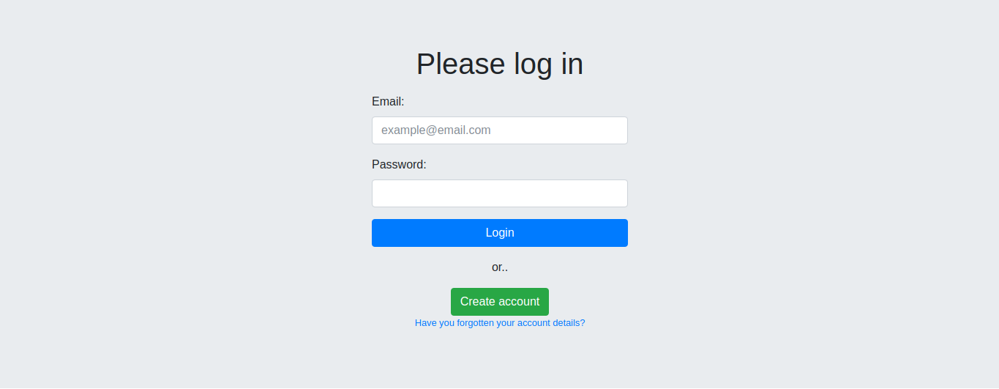

## Create-Account or Sign-up form
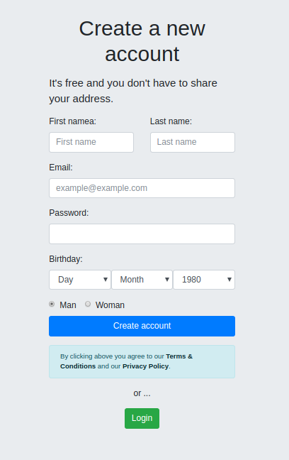

## Footer
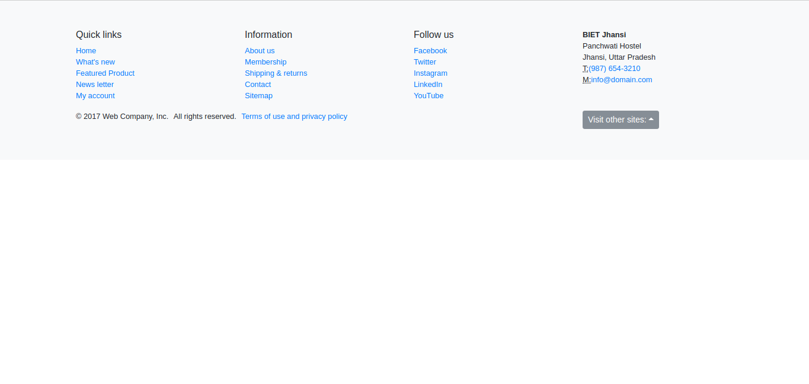

## Contact
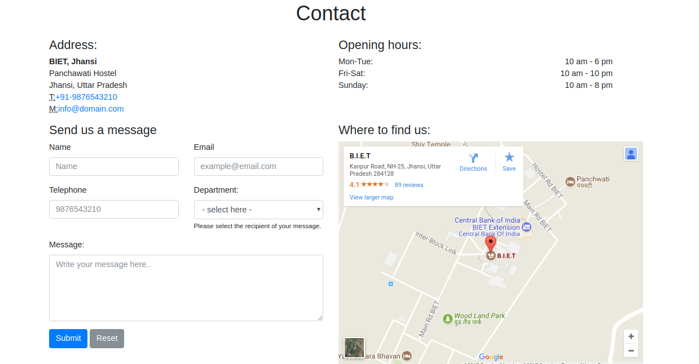

## Employees 
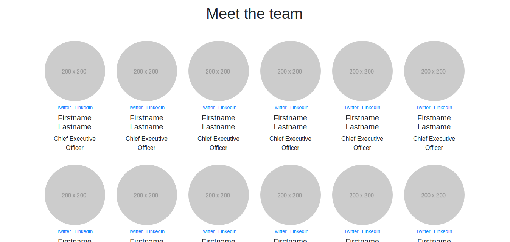

## Pricing Table
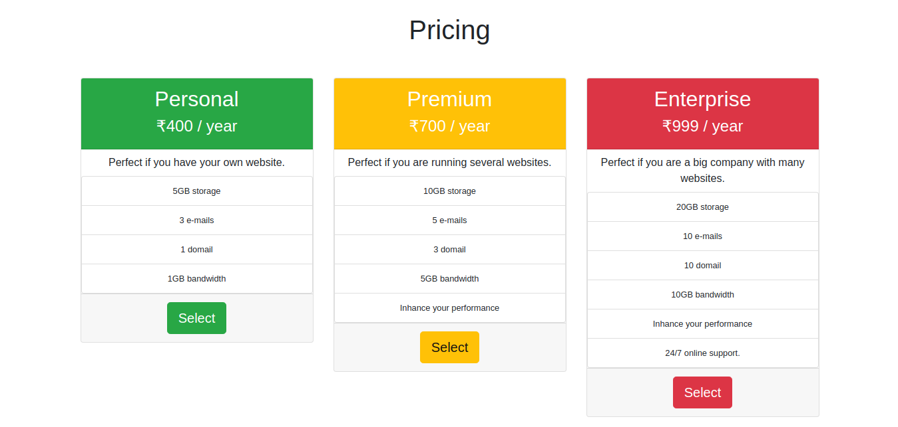

## Sitemap
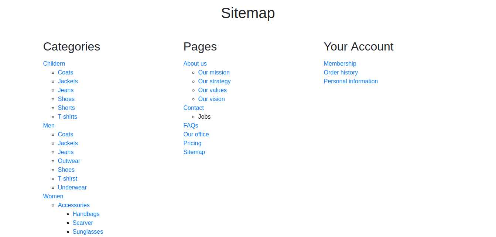

## Shortcuts
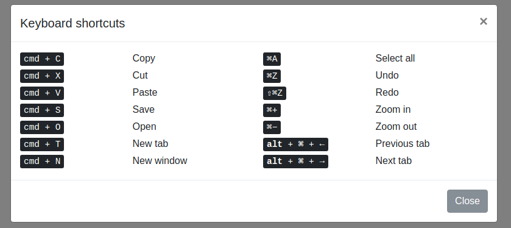

## Audio-Gallery
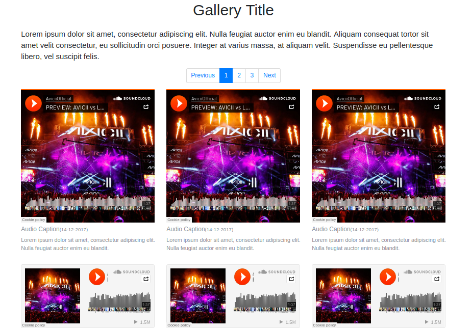

## Photo Gallery
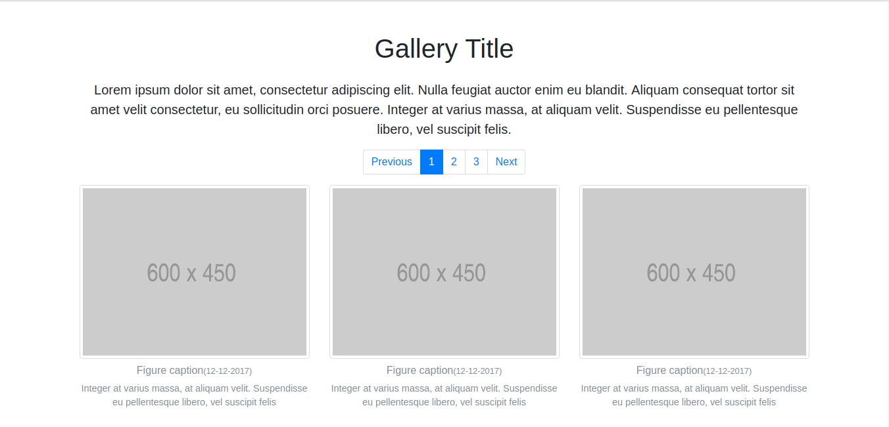

## Video Gallery 
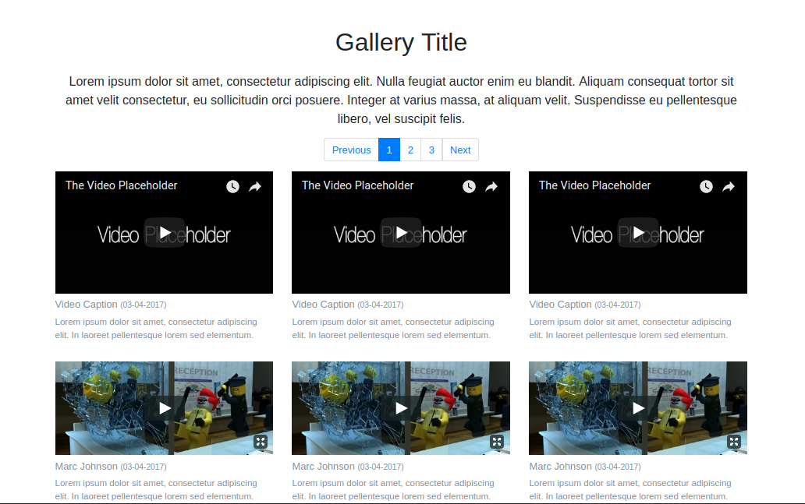

## Thank You
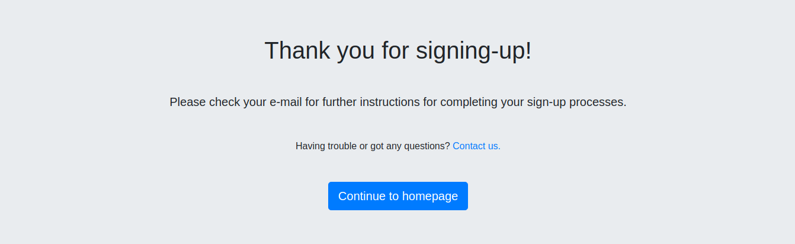